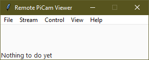
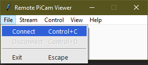
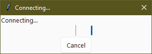
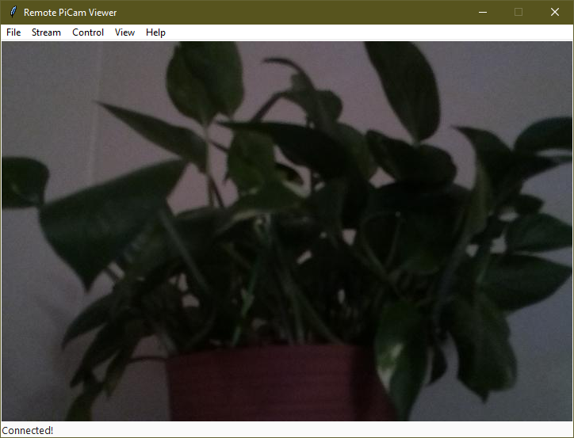
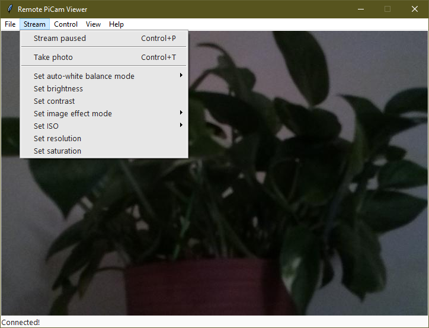
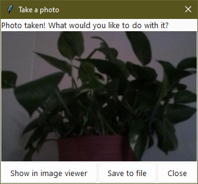
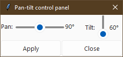
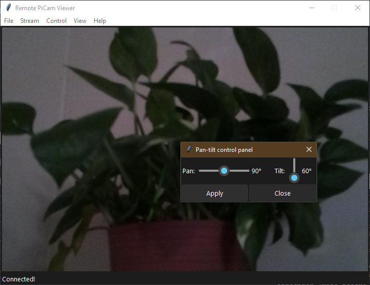

# Remote-PiCam-Viewer
View and control a Raspberry Pi Camera mounted on a Waveshare pan/tilt HAT!

## How to use

After launching the program, you should see a window that looks something like
this:

To connect to the PiCam, go to `File --> Connect`. 

You will get a loading screen like this:

Now run the Pi's main script. You can press `Cancel` or close that window to 
cancel connecting. 

On success, you will connect to the PiCam and see what the camera sees!

To disconnect, go to `File --> Disconnect` or `File --> Exit`. You can also 
close out of the window, and it will automatically disconnect before exiting. 

## Configuring camera settings

There are a bunch of options to configure in the `Stream` menu:

They should be pretty obvious on what they do. 

## Taking photos

You can take a photo by going to `Stream --> Take photo`. This will bring up a
new window showing buttons on what you want to do with it.

`Show in image viewer` will write the image to a temporary file and try to 
open it in the default image viewer for your platform.

`Save to file` will open a file save dialog so you can save the photo to 
somewhere. Please note that you have to type a supported file extension in the
name otherwise it will error out. 

Please note the photo resolution is determined by the current stream 
resolution.

## Panning/Tilting

If you have a Waveshare Pan/Tilt hat connected and it's enabled in the 
PiCam's settings file, (not the PiCam Viewer's settings file) you can go to
`Control --> Open pan-tilt control panel` and open the pan/tilt window.

The sliders should be self-explanatory. 

> Tip: Instead of dragging to move the slider, you can click on the slider 
> to move it left or right (or up and down, depending on the slider) by 1 
> degree. Right-click to set the slider value directly. 

## Dark mode

If the GUI's bright colors aren't your style, you can toggle dark mode in  
`View --> Dark mode`.

## Keyboard shortcuts

Here is a list of keyboard shortcuts available:

(Note that <kbd>Ctrl</kbd> will usually be <kbd>Cmd</kbd> on macOS unless 
specified)

Keyboard shortcut                | Action
---------------------------------|----------------------------------------------------------------
<kbd>Ctrl</kbd> + <kbd>c</kbd>   | Connect
<kbd>Ctrl</kbd> + <kbd>d</kbd>   | Disconnect
<kbd>Escape</kbd>                | Exit (also works on dialogs)
<kbd>Ctrl</kbd> + <kbd>p</kbd>   | Pause (or resume) the stream
<kbd>Ctrl</kbd> + <kbd>t</kbd>   | Take a photo of the stream
<kbd>Ctrl</kbd> + <kbd>s</kbd>   | Open the pan/tilt control panel ("s" stands for "servo")
<kbd>F1</kbd>                    | Open online help (opens the README file of this repo on GitHub)
<kbd>F1</kbd> + <kbd>Shift</kbd> | Open the README file in the default Markdown editor

You can also look in the menu and the accelerator will show the correct 
keyboard shortcut. 
