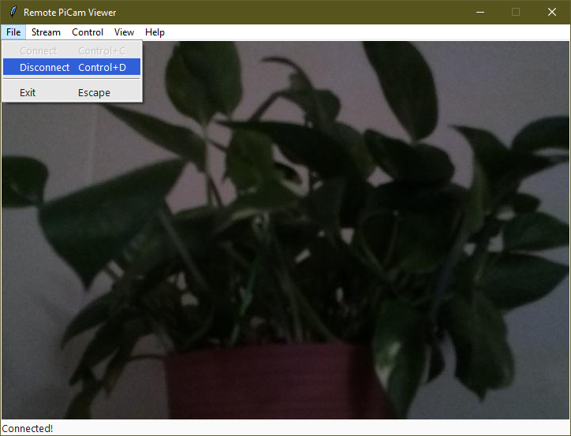

# Remote-PiCam-Viewer
View and control a Raspberry Pi Camera mounted on a Waveshare pan/tilt HAT!

## How to use

After launching the program, you should see a window that looks something like
this:

To connect to the PiCam, go to `File --> Connect`. 

You will get a loading screen like this:

Now run the Pi's main script. You can press `Cancel` or close that window to 
cancel connecting. 

On success, you will connect to the PiCam and see what the camera sees!

To disconnect, go to `File --> Disconnect` or `File --> Exit`. You can also 
close out of the window, and it will automatically disconnect before exiting. 

## Configuring camera settings

There are a bunch of options to configure in the `Stream` menu:

They should be pretty obvious on what they do. 

## Taking photos

You can take a photo by going to `Stream --> Take photo`. This will bring up a
new window showing buttons on what you want to do with it.

`Show in image viewer` will write the image to a temporary file and try to 
open it in the default image viewer for your platform.

`Save to file` will open a file save dialog so you can save the photo to 
somewhere. Please note that you have to type a supported file extension in the
name otherwise it will error out. 

Please note the photo resolution is determined by the current stream 
resolution.
