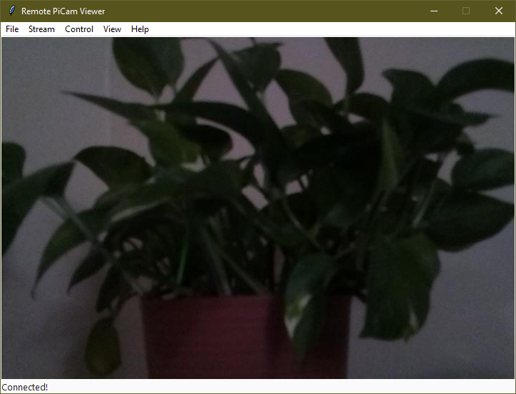

# Remote-PiCam-Viewer
View and control a Raspberry Pi Camera mounted on a Waveshare pan/tilt HAT!



## Installation

1. Make sure you have [Python 3.9](https://www.python.org/downloads/)
   installed, as [TkZero](https://github.com/UnsignedArduino/TkZero) needs 3.9.
2. [Follow the instruction](https://github.com/UnsignedArduino/Remote-PiCam/blob/main/README.md#installation)
   on setting up a Raspberry Pi in the 
   [Remote-PiCam](https://github.com/UnsignedArduino/Remote-PiCam) repo. 
3. `git clone` this repo and `cd` into it. 
4. Optional: Create a virtual environment with `python -m venv .venv` 
   (`python3` instead on Linux and macOS) and activate the virtual 
   environment with `".venv/Scripts/activate.bat"` 
   (`.venv/Scripts/activate.ps1` in Windows Powershell and 
   `source .venv/bin/activate` on Linux and macOS)
5. Install dependencies with `pip install -r requirements.txt`. (`pip3` on 
   Linux and macOS) You can find the list of dependencies in the 
   [requirements.txt](https://github.com/UnsignedArduino/Remote-PiCam-Viewer/blob/main/requirements.txt) 
   file.

## Usage

Run [`main.py`](https://github.com/UnsignedArduino/Remote-PiCam-Viewer/blob/main/main.py)
to start the program. For instructions on how to use the program, view
the [HELPME.md](HELPME.md) file. 

## Configuration
When you first run the script, a `settings.json` file should generate:
```json
{
    "camera": {
        "name": "picam",
        "port": 7896
    },
    "gui": {
        "dark_mode": false,
        "queue": {
            "check": 50,
            "size": 32
        }
    }
}
```

`camera.name` and `camera.port` should match in the PiCam settings, otherwise 
the software won't discover it (`name` is not correct) or it will stay 
connecting forever and get stuck. (`port` is not correct)

`gui.dark_mode` sets whether to use dark mode or not. (Thanks 
[@rdbende](https://github.com/rdbende) for the 
[Sun Valley theme](https://github.com/rdbende/Sun-Valley-ttk-theme)!)

`gui.queue.check` is how many milliseconds in between every queue check for an 
image. `gui.queue.size` is the image buffer size, low values can cause 
stuttering in bad network conditions, high values will use more memory and
cause noticeable delay. 
